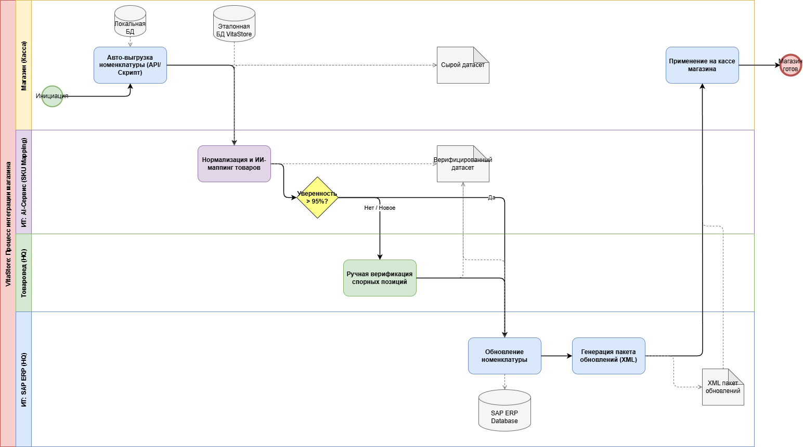

# Целевой процесс онбординга магазина (To-Be)

В рамках оптимизации процесса подключения новых (купленных) магазинов к сети VitaStore спроектирована целевая архитектура процесса в нотации BPMN 2.0 (файл `Onboarding_Process.drawio`). 

  
## Описание автоматизации и потока данных

Ручной конвейер интеграции баз данных заменяется на автоматизированный пайплайн:
1. Выгрузка сырых данных со старой кассы автоматизируется скриптами, передающими датасет по API, а не пересылкой Excel-файлов по почте.
2. Вместо макросов (VLOOKUP) в Excel применяется интеллектуальный **AI-сервис маппинга (SKU Mapping Service)**. Алгоритм нормализует «грязные» названия (например, «Крем д/рук синий») и сопоставляет их с эталонной БД товаров VitaStore.
3. Процесс разделен пулами на действия магазина, автоматические процессы ИТ-систем и действия человека (Товароведа).

## Точка верификации и участие человека (Human-in-the-loop)

Главная уязвимость полностью автоматического нечеткого поиска — ложные срабатывания (продажа дорогого крема по штрихкоду дешевого). Поэтому в процесс внедрена **Точка верификации (Confidence Score Gateway)**:

* **Машинный интеллект (Автоматика):** Если AI-алгоритм нашел соответствие и степень его уверенности (Confidence Score) превышает заданный порог (например, >95%), позиция автоматически проходит дальше и загружается в SAP ERP без участия человека.
* **Участие человека (Исключения):** Если система сомневается (Confidence <=95%), или товар полностью новый и аналогов в базе нет, алгоритм помечает эти строки и направляет их в очередь заданий (Task Queue) Товароведу.
* **Действия Товароведа:** Сотрудник работает только со спорными позициями. Он открывает интерфейс верификации, видит предложенные алгоритмом варианты и либо подтверждает один из них, либо заводит новую карточку товара вручную. 

**Эффект:** Такой подход снижает объем рутинной ручной работы на 80-90% (так как большая часть тривиального ассортимента совпадает и маппится автоматически), но при этом сохраняет 100% контроль над аномалиями и исключает критические ошибки на кассах.