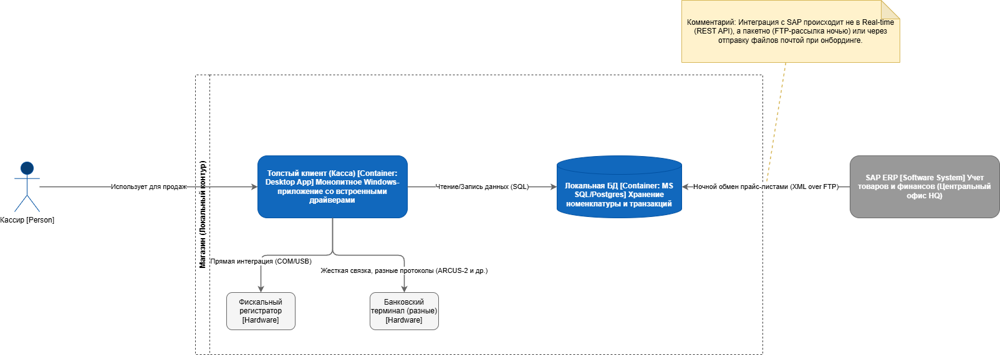
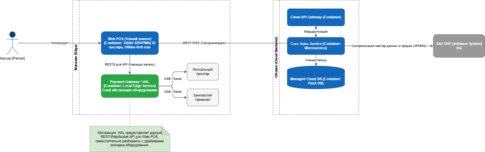

# Разработка целевой облачной архитектуры (HLD)

Схемы архитектуры (AS-IS и TO-BE) представлены в соответствующих файлах `AS_IS_Architecture.drawio` и `TO_BE_Architecture.drawio`.
  

  

  
## Механизм работы офлайн-режима и синхронизации данных

Для обеспечения отказоустойчивости при обрыве связи кассовое приложение (Web POS / Tablet App) построено по принципу Offline-First с использованием локального кэширования (Local Storage / IndexedDB). В штатном (онлайн) режиме приложение регулярно скачивает из Cloud Backend и кэширует на устройстве так называемый «срез» критичных мастер-данных: актуальные цены, штрихкоды товаров и базовые правила промоакций.

При отключении интернета касса автоматически переходит в **Offline-режим**. Безналичная оплата становится недоступной (терминал не может связаться с банком без сети), однако продажа за наличные продолжает работать штатно: приложение ищет товары по локальному кэшу, рассчитывает стоимость корзины и передает команду на локальный фискальный регистратор через слой абстракции оборудования (HAL). Чек печатается, а данные о транзакции сохраняются в локальную очередь событий (Message Queue) на планшете.

При восстановлении сетевого подключения запускается фоновый процесс **Синхронизации (Sync Worker)**. Кассовое приложение асинхронно отправляет накопленную очередь транзакций в Cloud Backend. Облачный сервис валидирует данные, сохраняет их в централизованную базу (Managed DB) и отправляет подтверждение на кассу, после чего транзакции удаляются из локального кэша планшета. Далее Cloud Backend самостоятельно маршрутизирует эту информацию в центральный SAP ERP для обновления остатков.